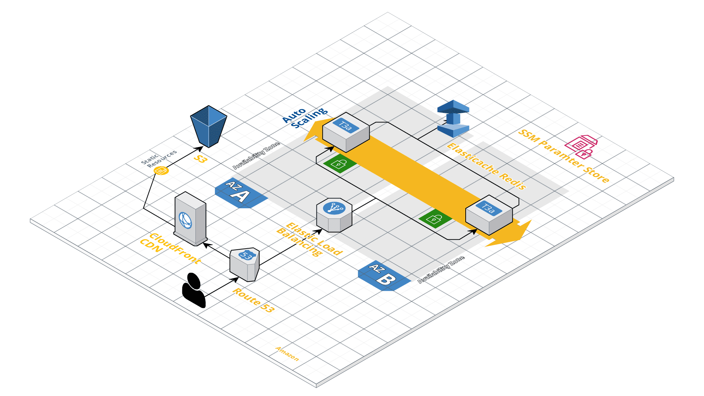

# Helsinki Places

This web application is built to display places of interest in Helsinki city. Visit [My Helsinki](https://helsinki-places.mlem-mlem.net) here

## Project Structure

The project has 3 building block:

- backend
- frontend-react
- infrastructure

### Backend

An express REST API that will server the react application with data of places coming from [My Helsinki Open API](https://open-api.myhelsinki.fi/doc). The API also connects to a Redis Elasticache node on AWS for response caching. API secrets are stored on SSM parameter store

### Frontend-React

A React Web Application that handles data display. There are two view modes: table and map. The website is hosted on AWS S3 and served by Cloudfront for faster delivery

### Infrastructure

The infrastructure for the entire project is built upon AWS and use Terraform to manage the AWS resources. An overview design of the architecture is shown below:

## Instructions

1. Clone this project: `git clone https://gitlab.com/nguyenduy010798/helsinki-places.git`
2. Allow script execution: `cd helsinki-places && chmod 700 scripts/*`
   Make sure to run the all the commands or scripts from the project root directory:
3. Install dependencies: `./scripts/install.sh`
4. Produce the build: `./scripts/build.sh`
5. To run or test the project without docker (see below for using docker), make sure a redis database is running at localhost at port 6379
6. Run the backend: `cd backend && yarn run start:dev`
7. Run the backend: `cd frontend-react && yarn run start`
8. Run test backend: `cd backend && yarn run test`
9. Run test frontend: Make sure both the redis database, backend server, and frontend are running.
   Then: `cd frontend-react && yarn run test:e2e`

To run the project in development with docker:

1. `docker-compose build`
2. `docker-compose up`

## Deployments

When pushing to project to Gitlab on master branch, a CI/CD pipeline will be triggered for building, testing, and finally deploy the project to AWS.

Before the CI/CD pipeline can run, you need to create the infrastructure first. The terraform code can be found in the **infrastructure** folder.

1. `cd infrastructure && terraform init`
2. `terraform apply` This will ask for some variables, you can find the description of the input variables from `variables.tf` file
3. After the infrastructure is successfully created, then we can trigger the CI/CD pipeline

To deploy the project, you need to have:

1. An AWS account or IAM user with these permissions:

   - AmazonEC2FullAccess
   - IAMFullAccess
   - AmazonElastiCacheFullAccess
   - AmazonS3FullAccess
   - AWSCodeDeployFullAccess
   - CloudFrontFullAccess
   - AmazonSSMFullAccess
   - AmazonVPCFullAccess
   - AWSKeyManagementServicePowerUser
   - AmazonRoute53FullAccess

2. Create these env for Gitlab CI/CD:

   - AWS_ACCESS_KEY_ID: your aws access key ID, can be retrieve in IAM console
   - AWS_SECRET_ACCESS_KEY: your aws secret access key
   - DISTRIBUTION_ID: the Cloudfront distribution ID, retrieve from Cloudfront console
   - S3_BACKEND_LOCATION: the location of the s3 bucket that will store your backend code revision in s3 format: `s3://bucket-name`
   - S3_BACKEND_LOCATION_NAME: the name of the backend bucket
   - S3_FRONTEND_LOCATION: the location of the s3 bucket that will store your frontend static files in s3 format: `s3://bucket-name`

:exclamation: If the CI/CD pipeline fails at step `test-backend`. Then in the `redis.ts` file, line 12, replace the value `localhost` with `redis`
